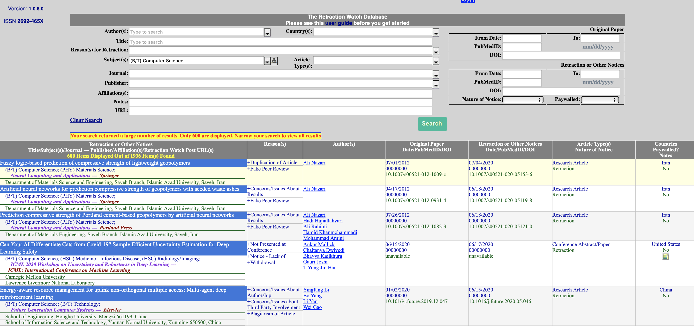

## What are the most common causes to retract papers?
I got inspired by a presentation by [Jessica Bonnie](https://github.com/realviacauchy) on paper retractions. I wondered about the most common causes for retractions.

### The Retraction Watch Database (RWB) is great, but ...
The Retraction Watch database tracks retracted papers. If you search for retracted papers it gives you the reasons behind each retraction (see Reasons(s) column in Figure 1). But, each serach gives you at most 600 items. To get the full dataset, we would require an instituion-level permission. It would be over-killing to involve my institution for my personal interest. So, I decided to search the database manually for a few fields, download and parse the results, and finally analyse the results.

|  | 
|:--:| 
**Figure 1: The retraction watch database search interface.**

## Method
I downloaded the retracted papers in the following seven fields:
1. Biostatistics / Immunology
2. Computer Science
3. General Arts
4. General Business
5. General Medicine
6. Molecular Biology
7. Psychology

Why did I choose these fields? It is a completely personal choice - I am interested to know the trend in these fields.

I attempted to download all retracted papers in each field. If the total number of retracted papers was above 600, I selected a suitable date range that brought the number below 600. Then I merged these papers and counted the number of retracted papers for each reason.

## Top reasons for retraction

For a big fraction of retracted papers, the retraction notice did not contain enough information to categorize the cause (see Figure 2). Investigation by publishers or institutions is the most common reason for retraction. Other notable reasons are: Withdrawal (article removed from access on the publishing platform), fake peer review, policy breach, and plagiarism (duplication = self-plagiarism). Error in data is the 10-th most common reason. To know the top reasons in each field, please have a look [here](results/top_reasons_for_retractions.pdf).

|  | 
|:--:| 
**Figure 2: The most frequent reasons for retraction in selected fields.**

Retractions consist of both *research misconducts* and *honest mistakes*. To get an idea which category is relatively more prevalent, I consider retractions due to investigation, fake review, policy breach or plagiarism as _**misconducts**_, and retractions due to error or voluntary withdrawal as _**mistakes**_. Though we do not know what fraction of "Withdrawal" is voluntary, we see that misconduct is relatively more common compared to mistakes.

## Do top journals have similar reasons?

I downloaded the papers retracted from 3 top journals: Nature, Science and Cells and computed the top reasons for retraction from these journals (see Figure 3). It seems that mistakes (errors, unreliable/not-reproducable results) are relative more common in these journals compared to the general trend we observed before in Figure 2. However, misconducts are also present.

|  | 
|:--:| 
**Figure 3: The most frequent reasons for retraction from top journals (Nature, Science, Cells).**

## How about my own university - Johns Hopkins University (JHU)?
Similar to top journals, I see a combination of mistakes and misconducts by JHU affiliates (see Figure 4).

|  | 
|:--:| 
**Figure 4: The most frequent reasons for retraction by JHU affiliates.**

## Please keep in mind ...
Please keep in mind that this analysis used only a fraction of data from the retraction watch database. Moreover, the database may list multiple reasons for each retracted paper, and we do not know which one is the primary reason. Some papers may be double-counted if they span multiple fields. Notably, this analysis does not give any statistical significance. Analysis may also be biased by the number of published papers in each field. Also, there were relatively small number of retracted papers from JHU affiliates (34), and consequently the estimated top reasons might not be robust. Though everyone should keep these limitations in mind, this analysis should give a general idea about the causes of retraction.

## Conclusion
The most common reasons for retraction include investigation by publishers/institutions, paper withdrawal, fake peer review, plagiarism and errors. In general, misconducts seem to be more common compared to mistakes. In top journals, though mistakes are relatively more common compared to those in average publishing venues, misconducts are also common.
